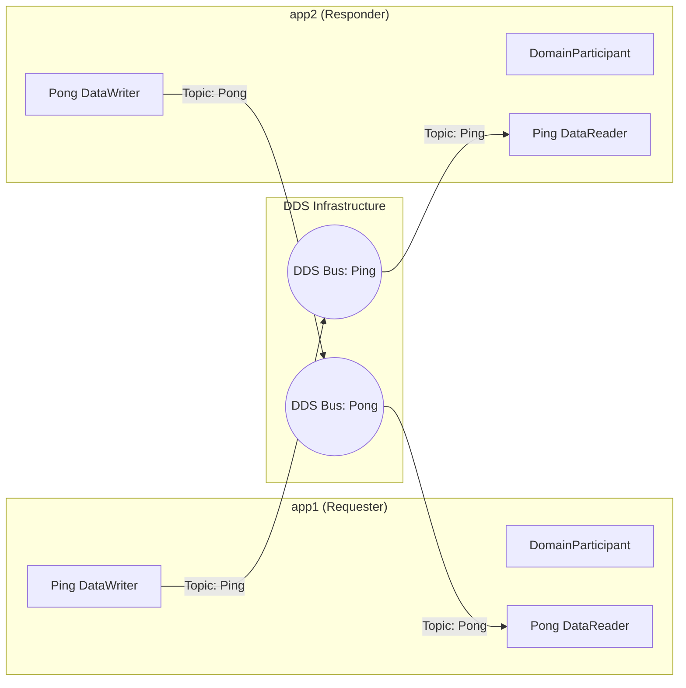
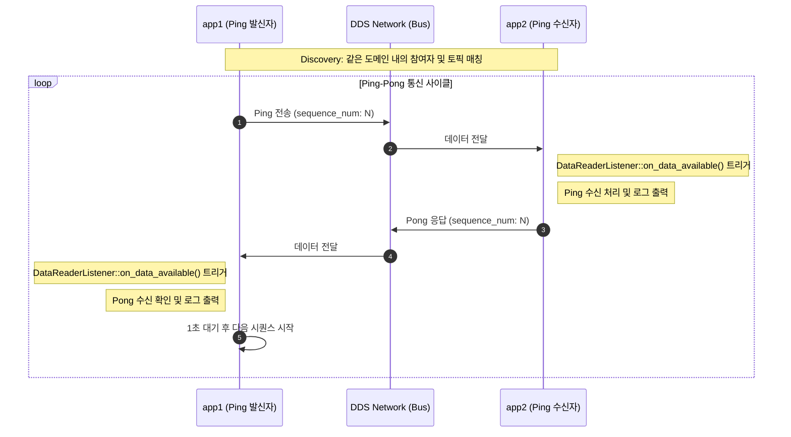

# Architecture: RTI Ping-Pong Example

이 문서는 RTI Connext DDS를 사용한 Ping-Pong 예제의 전반적인 구조와 동작 원리를 설명합니다.

## 1. 시스템 개요

본 프로젝트는 두 개의 독립적인 분산 애플리케이션(`app1`, `app2`)이 DDS(Data Distribution Service) 버스를 통해 데이터를 주고받는 구조를 보여줍니다.

---

## 2. DDS 엔티티 계층 구조

각 애플리케이션은 DDS 표준에 따라 다음과 같은 객체 계층을 가집니다.

*   **DomainParticipant**: DDS 네트워크에 참여하는 기본 단위 (Domain ID 0 사용).
*   **Topic**: 통신할 데이터의 이름과 데이터 타입을 정의 ("Ping", "Pong").
*   **Publisher/Subscriber**: 데이터 전송 및 수신의 그룹화 관리.
*   **DataWriter/DataReader**: 실제 데이터를 네트워크에 쓰고 읽는 통로.

---

## 3. 시퀀스 다이어그램 (Sequence Diagram)

애플리케이션 간의 상호작용 흐름입니다.

---

## 4. 데이터 모델 (IDL)

`ping_pong.idl`에 정의된 데이터 구조입니다.

| 필드명 | 타입 | 설명 |
| :--- | :--- | :--- |
| `sender_id` | `string` | 메시지를 보내는 쪽의 아이디 ("app1" 또는 "app2") |
| `sequence_num` | `long` | 메시지의 순서 번호 (Ping과 Pong 매칭용) |

---

## 5. QoS (Quality of Service) 설정

`USER_QOS_PROFILES.xml`을 통해 통신 품질을 관리합니다.

*   **Reliability**: `RELIABLE_RELIABILITY_QOS` 설정을 통해 패킷 유실 시 DDS 레이어에서 자동으로 재전송을 시도합니다.
*   **History**: `KEEP_LAST_HISTORY_QOS` (depth=1)로 가장 최신의 메시지 한 개만 큐에 보존하여 지연 시간을 최소화합니다.

---

## 6. 빌드 및 실행 구성

1.  **IDL Compilation**: `rtiddsgen`이 IDL을 C++ 소스 코드로 변환.
2.  **CMake Build**: MSVC 컴파일러를 사용하여 `app1`, `app2` 별도 실행 파일 생성.
3.  **Execution**: 환경 변수 `RTI_LICENSE_FILE`을 통해 RTI 라이선스를 로드한 상태에서 실행.
