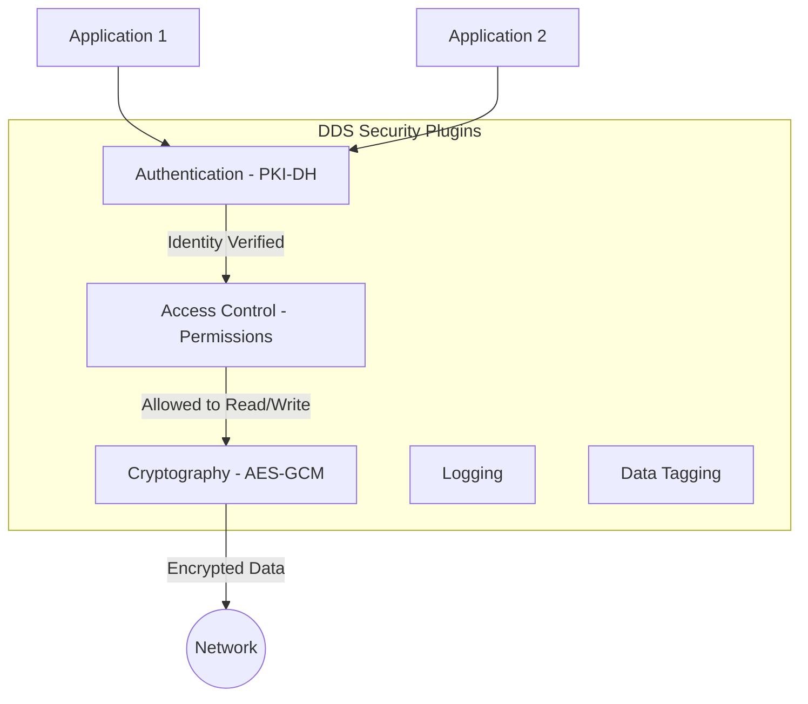

# DDS Security Implementation Plan

이 문서는 **RTI Connext DDS Security Plugins**를 사용하여 프로젝트에 보안 인증 및 권한 관리를 구현하기 위한 상세 계획을 설명합니다.

---

## 1. 보안 아키텍처 (DDS Security Architecture)

DDS Security는 OMG(Object Management Group) 사양을 따르며, 크게 5가지 보안 플러그인으로 구성됩니다. 본 프로젝트에서는 **Authentication**, **Access Control**, **Cryptography**를 중점적으로 다룹니다.



---

## 2. 보안 자산 구성 (Security Artifacts)

보안 통신을 위해 다음과 같은 PKI 기반 파일들이 필요합니다.

| 분류 | 파일명 | 설명 |
| :--- | :--- | :--- |
| **Identity CA** | `identity_ca.pem` | 참가자들의 신원을 보증하는 최상위 인증 기관의 인증서 |
| **Permissions CA** | `permissions_ca.pem` | 거버넌스 및 권한 파일의 무결성을 보증하는 인증서 |
| **Identity Certificate** | `app_id.pem` | 각 애플리케이션(Participant)의 신분증 |
| **Private Key** | `app_key.pem` | 각 애플리케이션의 개인키 (비공개) |
| **Governance** | `governance.xml` | 도메인 전체의 보안 정책 (인증 여부, 암호화 수준 등) |
| **Permissions** | `permissions.xml` | 개별 Participant의 구체적인 토픽 접근 권한 |

---

## 3. 세부 구현 단계

### 단계 1: 보안 인증서 생성 (PKI Provisioning)
`rtissg` (RTI Security Secret Generator) 또는 `openssl`을 사용하여 테스트용 CA와 인증서를 생성합니다.
*   Identity CA 생성
*   App1/App2의 시그니처 요청 및 발급
*   거버넌스 및 권한 파일 서명 (`.p7s` 파일 생성)

### 단계 2: QoS 프로파일 업데이트
`USER_QOS_PROFILES.xml`에 보안 플러그인을 활성화하는 속성을 추가합니다.

```xml
<participant_qos>
    <property>
        <value>
            <element>
                <name>dds.sec.auth.builtin.PKI-DH.identity_ca</name>
                <value>cert/identity_ca.pem</value>
            </element>
            <element>
                <name>dds.sec.auth.builtin.PKI-DH.identity_certificate</name>
                <value>cert/app1_id.pem</value>
            </element>
            <element>
                <name>dds.sec.access_control.builtin.PKI-DH.governance</name>
                <value>cert/governance.p7s</value>
            </element>
            <!-- 추가 보안 설정 속성들... -->
        </value>
    </property>
</participant_qos>
```

### 단계 3: 거버넌스 및 권한 정의
*   **Governance.xml**: 도메인 0번에 대해 `allow_unauthenticated_participants`를 `false`로 설정하여 인증되지 않은 노드의 접근을 원천 차단합니다.
*   **Permissions.xml**: `app1`은 `Ping` 토픽에 `PUBLISH`, `app2`는 `Ping` 토픽에 `SUBSCRIBE` 권한만 가지도록 제한합니다.

---

## 4. 검증 시나리오 (Test Scenarios)

1.  **인증 성공**: 올바른 인증서를 가진 App1, App2 간의 정상적인 Ping-Pong 확인.
2.  **인증 실패**: 인증서가 없는 외부 애플리케이션이 도메인에 참여하려고 할 때 `Inconsistent Topic` 또는 `Authentication Failed` 에러와 함께 차단되는지 확인.
3.  **권한 위반**: App2가 허용되지 않은 `Ping` 토픽에 Write를 시도할 경우 DDS 계층에서 차단되는지 확인.

---

## 5. 향후 일정 (Roadmap)

1.  [ ] 보안 인증서 생성 스크립트 작성 (`gen_certs.ps1`)
2.  [ ] 보안 전용 `SECURE_USER_QOS_PROFILES.xml` 작성
3.  [ ] 애플리케이션 코드에서 인증서 경로 로드 로직 추가
4.  [ ] 보안 적용 환경에서의 동작 테스트
